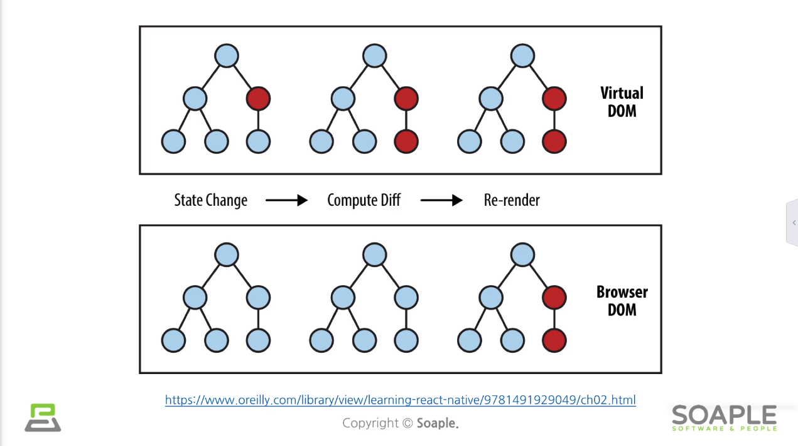
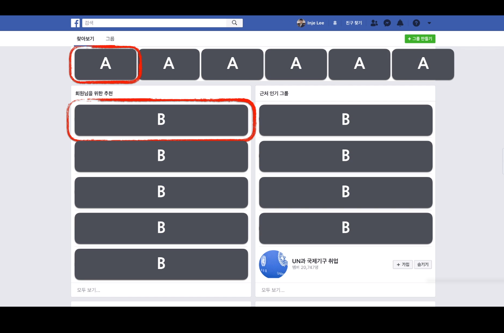

# 리엑트
## 리엑트란?
<b>화면</b>을 만들기 위한 자바스크립트 라이브러리  

## 리엑트와 닮은 라이브러리
Angular(Google), React(Facebook), Vue.js

## 리엑트와 장점
- 빠른 업데이트, 렌더링 속도 (Virtual DOM)
- Component-Based
- 든든한 빽이 있다! (Facebook)
- 활발한 지식공유, 커뮤니티
- React Native 까지 배우면 <b>모바일 앱도 개발 가능!!!</b>

## Virtual DOM
웹에서 업데이트를 할 때, 업데이트(변경)을 해야할 최소한의 것만 변경함  
즉, 바뀌어야 할것만 업데이트하여 속도를 빠르게 함.  

## Component-Based
레고 블록을 조립하듯이 컴포넌트들을 모아서 개발  
컴포넌트를 사용하여 재사용성이 커짐(개발속도가 빨라짐)  

## 리엑트의 단점
- 공부해야 할 것이 좀 많음 ㅠㅠㅠ
- 계속 뭐가 빠르게 바뀜..