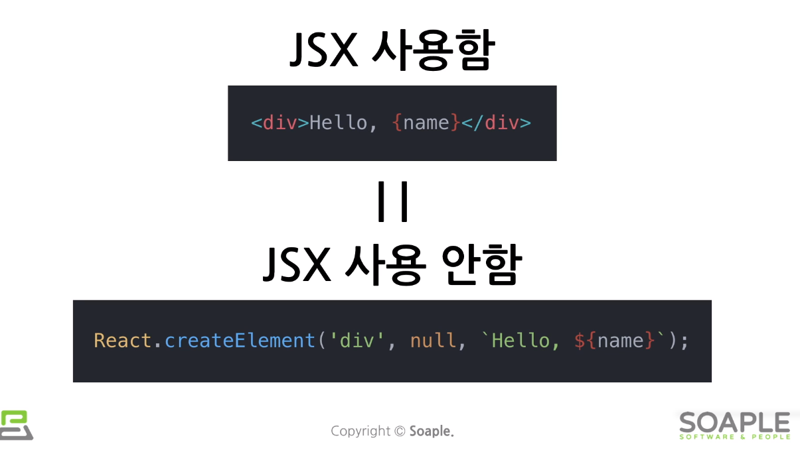
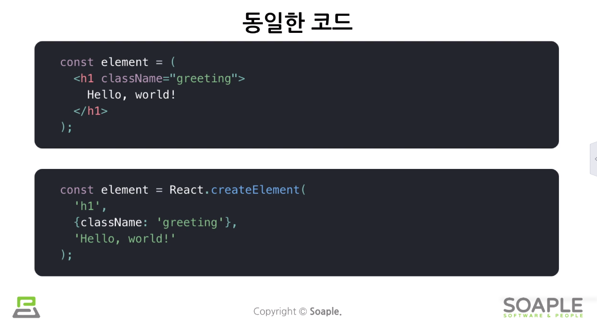

# JSX 소개
## JSX 는 뭘까?
A syntax extension to JavaScript <br>
즉 JavaScript에다가 XML / HTML 을 더한 것 <br>
```js
const element = <h1>Hello, world!</h1>
```
뭔가 좀 이상하죠? 이것이 JSX 예제 코드입니다. <br>
꼭 jsx를 사용할 필요는 없지만 강의에서는 추천하셨네요. <br>
 <br>

## JSX의 장점
- 간결한 코드!
- 가독성 향상!
- 버그를 발견하기 쉬움!

## JSX 살펴보기
jsx 는 객체를 나타낸다! <br>
 <br>
React.createElement()의 결과로 위와 같은 객체가 생성됨 <br>

## 예제 코드
```js
const name = 'exon';
const elemet = <h1>Hello, {name}</h1>

ReactDOM.render(
    element,
    document.getElementById('root')
)
```
중괄호{}안에 함수를 호출하여 반환값도 쓸 수 있다. <br>

### Children 정의
```js
const element = (
    <div>
        <h1>Hello</h1>
        <h1>Hi</h1>
    </div>
)
```
div로 감싸주기